# WanAndroid Desktop 🚀

一款基于 **Tauri 2.0** + **Vue 3** + **TypeScript** 开发的高颜值 WanAndroid 桌面客户端。旨在为 Android 开发者提供极致的阅读与学习体验。

本项目是 WanAndroid 桌面端的 Tauri 版本，相比于 Electron 版本，具有更小的体积和更优的性能。

<div align="center">
  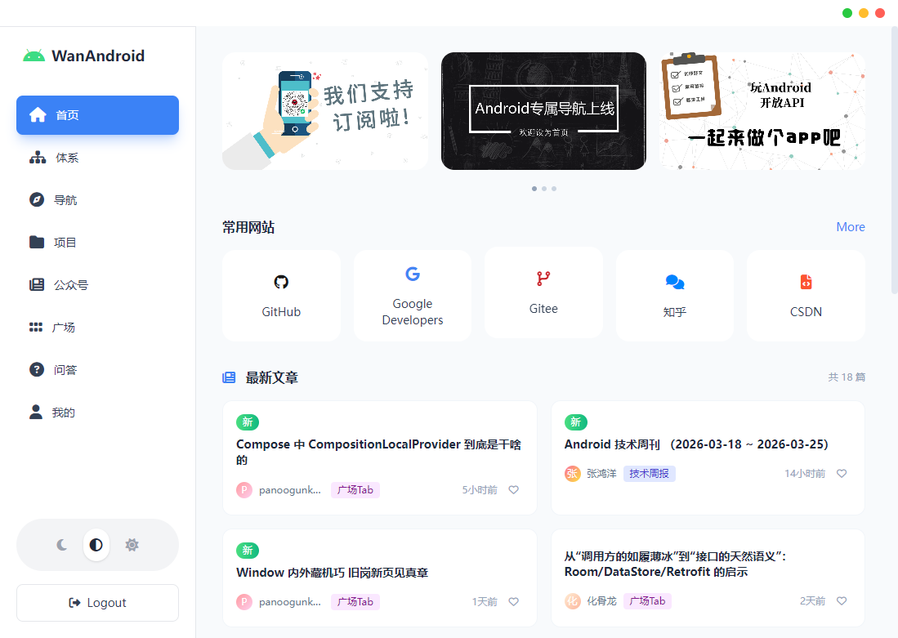
</div>


## ✨ 特性

### 功能完备
-   **首页动态** - 轮播图、置顶文章、最新博文流。
-   **体系架构** - 完整的知识体系划分，涵盖 Android 核心考点。
-   **项目精选** - 分门别类的优质开源项目展示。
-   **导航广场** - 常用网站、工具、官方文档一键直达。
-   **公众号/问答** - 同步玩 Android 优质内容，紧跟技术趋势。
-   **积分排行榜** - 实时同步用户积分，激励技术成长。
-   **我的收藏** - 跨平台同步收藏内容，随时随地查阅。

### 用户体验
-   **极致 UI** - 采用 TailwindCSS + 原生 CSS 构建，适配 Material Design 风格。
-   **深色模式** - 完美适配深色/浅色模式，支持跟随系统自动切换。
-   **无边框设计** - 类 macOS 的精致窗口体验，自定义标题栏。
-   **丝滑动画** - 内置微交互动画，操作反馈更自然。

### 技术亮点
-   **Tauri 2.0** - 极小包体积，更安全的 Rust 后端驱动。
-   **高性能 Http** - 使用 `tauri-plugin-http` 绕过 CORS 限制，请求更稳定。
-   **TypeScript** - 全量类型定义，保证代码健壮性。
-   **Vite 驱动** - 毫秒级热更新，极速开发体验。

## 📸 界面预览

### 主题切换
<div align="center">
  <p align="center">
    
    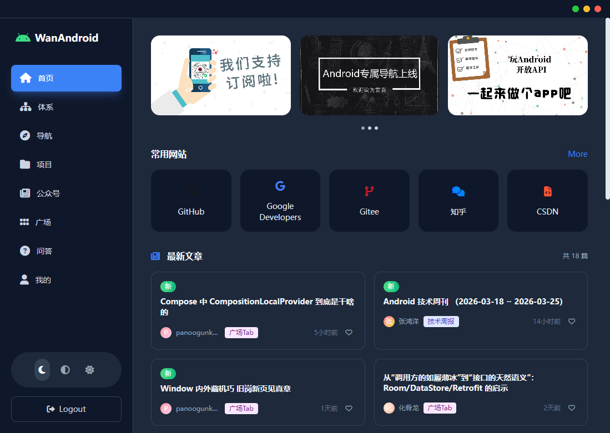
  </p>
  <p><em>(界面支持根据系统主题自动切换深色/浅色)</em></p>
</div>

### 核心模块
| 首页 | 体系 |
| :---: | :---: |
|  | 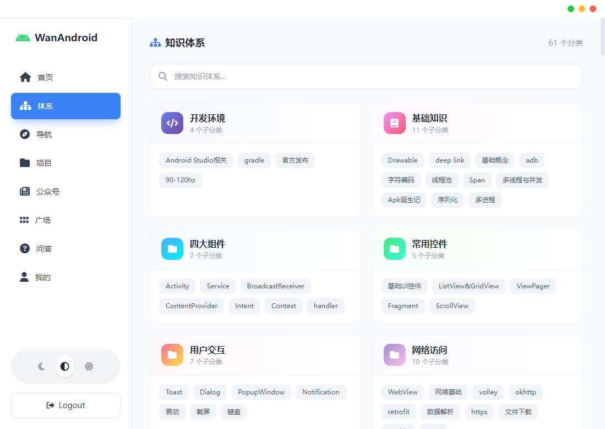 |

| 导航 | 项目 |
| :---: | :---: |
| 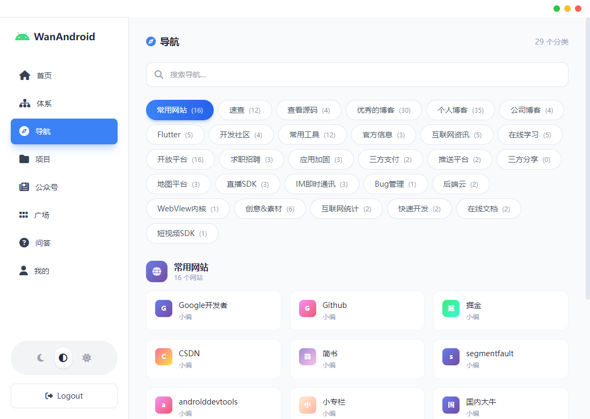 | 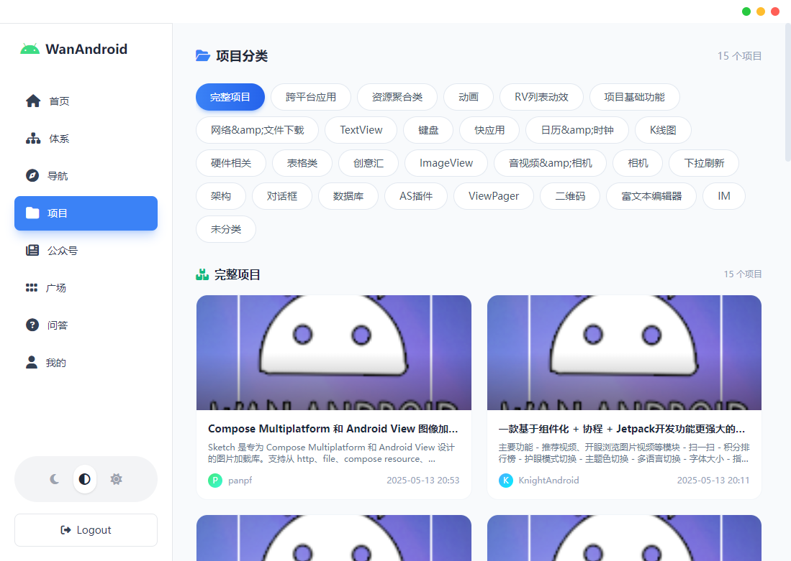 |

| 公众号 | 广场 |
| :---: | :---: |
| 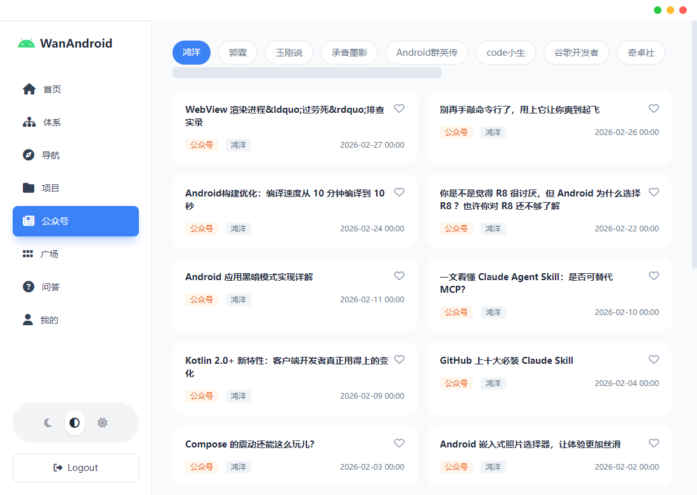 | 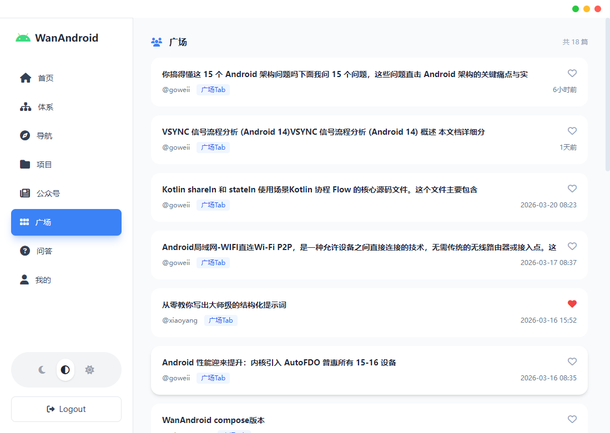 |

| 问答 | 排行榜 |
| :---: | :---: |
| 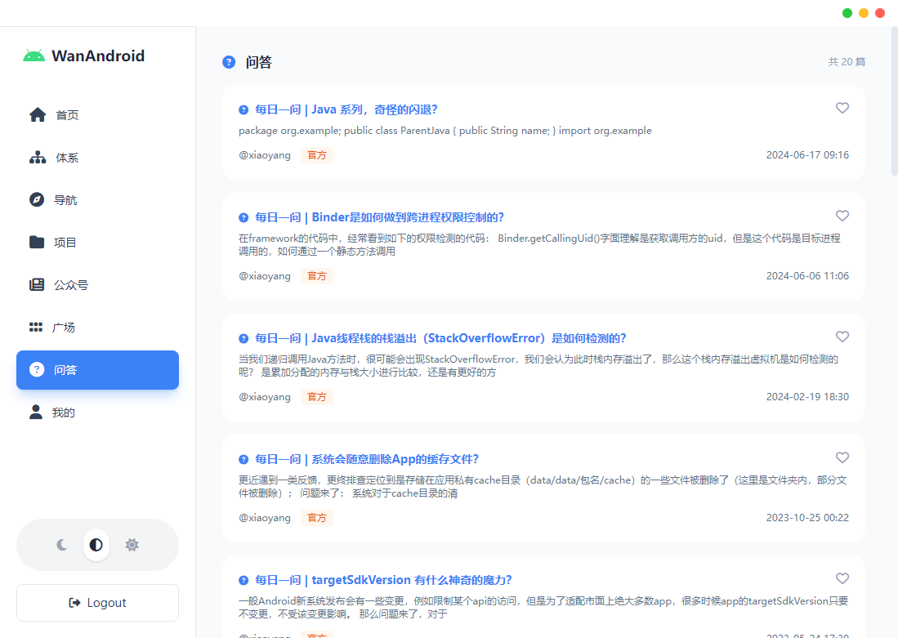 | 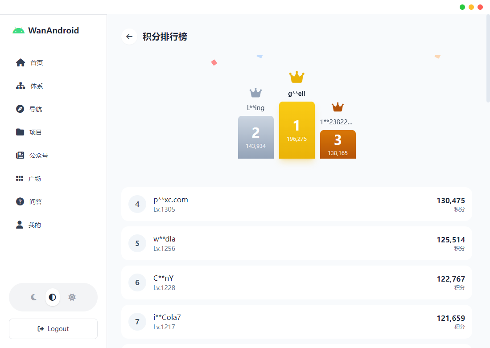 |

| 我的 | 我的收藏 |
| :---: | :---: |
| 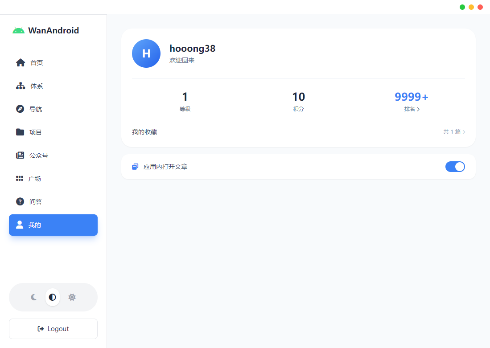 | 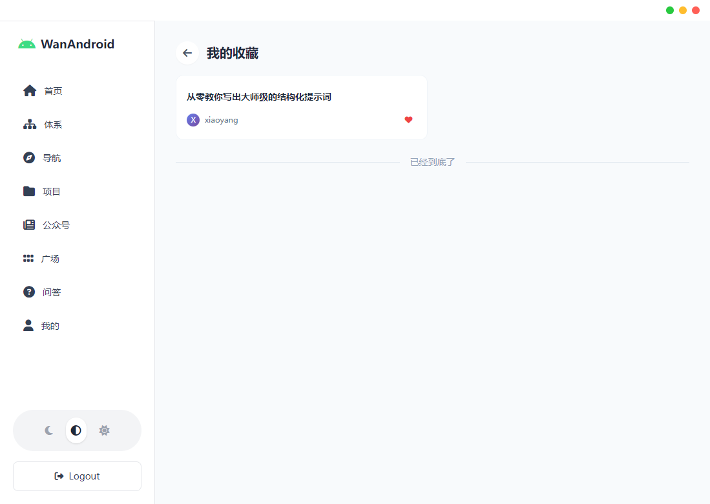 |

| 页面浏览 |
| :---: |
| 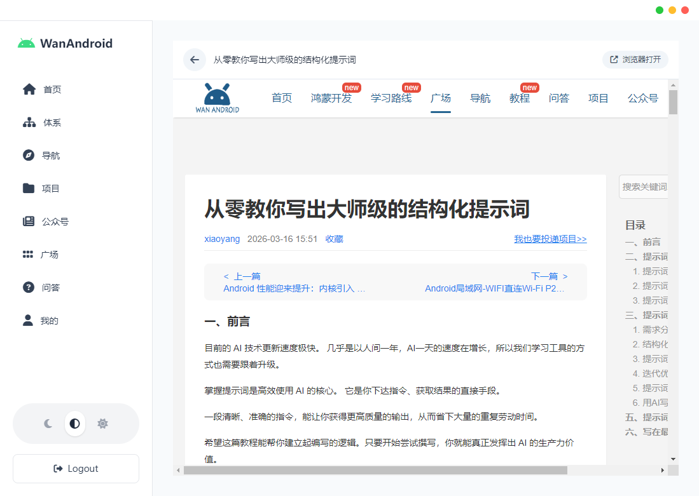 |

## 🛠️ 技术选型

-   **核心框架**: [Tauri 2.0](https://v2.tauri.app/) + [Vue 3](https://vuejs.org/)
-   **编程语言**: [TypeScript](https://www.typescriptlang.org/) + [Rust](https://www.rust-lang.org/)
-   **状态管理**: [Pinia](https://pinia.vuejs.org/)
-   **路由管理**: [Vue Router 4](https://router.vuejs.org/)
-   **样式处理**: [Tailwind CSS](https://tailwindcss.com/)
-   **网络请求**: [Axios](https://axios-http.com/) + [tauri-plugin-http](https://github.com/tauri-apps/plugins-workspace)
-   **图标库**: [FontAwesome](https://fontawesome.com/)

## 🚀 快速开始

### 开发环境
-   Node.js >= 18.x
-   Rust 环境 (Cargo)

### 安装与运行
```bash
# 安装依赖
npm install

# 启动开发服务器
npm run tauri:dev

# 构建安装包
npm run tauri:build
```

## 📂 项目结构

```text
wanandroid-tauri/
├── src-tauri/          # Rust 后端代码
│   ├── capabilities/   # Tauri 2.0 权限配置
│   └── src/            # 指令与窗口逻辑
├── src/                # 前端 Vue 源码
│   ├── api/            # API 封装与拦截器
│   ├── components/     # 全局公共组件
│   ├── stores/         # Pinia 状态管理
│   ├── views/          # 业务页面 (首页、项目、体系等)
│   └── types/          # TS 类型定义
├── public/             # 静态资源
├── IMG/                # 界面效果图
└── README.md
```

## 🛡️ 许可证
本项目基于 MIT 许可证开源。仅供学习交流使用。

---
**WanAndroid Desktop** - 为 Android 开发者打造的桌面阅读神器。
